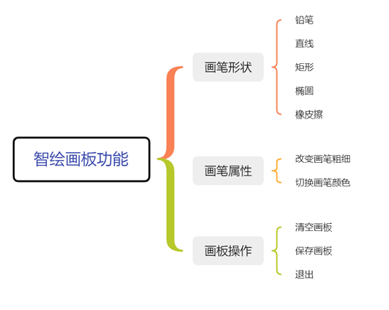
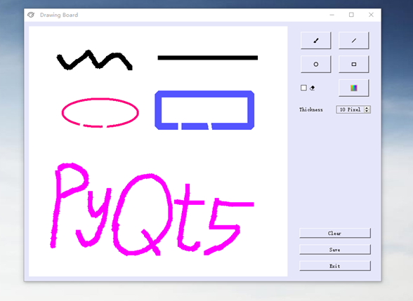
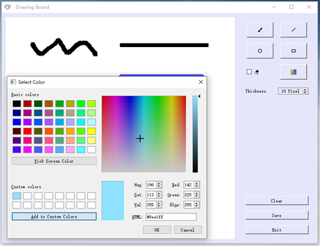
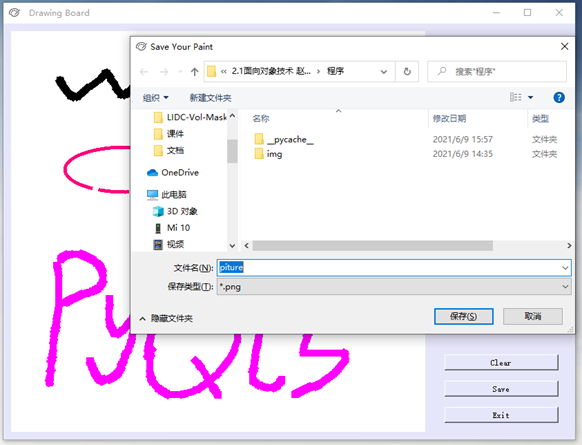

## Drawing Board

Drawing Board is my big assignment for Object-Oriented Techniques, a simple drawing board based on PyQt5 implementation.


### Usage

- Install PyQt5 

  ```bash
  pip install PyQt5
  ```

- Run

  Clone this repository and go to the home directory and run the script.

  ```bash
  # clone
  git clone https://github.com/shengkai365/Drawing-Board.git
  
  # switching directory
  cd Drawing-Board
  
  # run
  python3 main.py
  ```


### Functions

This project implements the main functions of the drawing board, including brush shapes, brush properties and drawing board operations, as shown below. For more implementation principles, please see `description.docx`.




### Demo





